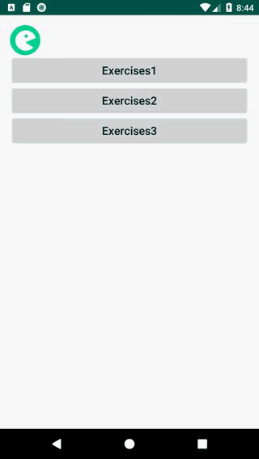
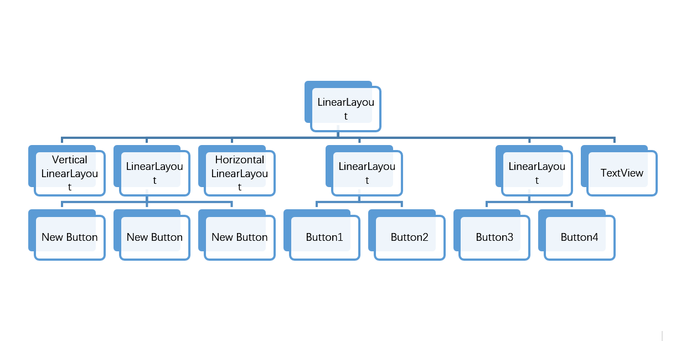

# HOMEWORK_20190119_UI

## 1、Exercise1

* 实现效果

进入页面时，页面显示从onCreate()到onResume()方法的日志。
	
当旋转手机时，页面显示上一次从onCreate()到onDestroy()的所有周期记录的日志。其中，缓存开始与缓存结束是我手动加入以进行区别的分界线。
若进行多次旋转，会出现如下界面，为正常现象，因为存储时直接将TextView中的内容完全进行存储，最外层的缓存开始与缓存结束中的内容为上一次保存的内容。：


* 实现方法

* 编写MyApplication类继承自Application，在AndroidManifest文件中将此Application注册，实现getname()与setname()方法。
```java
public class MyApplication extends Application {
    public String name;
    public String getName() {
        return name;
    }

    public void setName(String name) {
        this.name = name;
    }

    @Override
    public void onCreate() {
        // TODO Auto-generated method stub
        super.onCreate();
    }
}
```

* 在Exercise1.java文件中，在此Activity的onCreate()方法中，利用getApplication()方法取得当前所在的Application, 强制转化为MyApplication对象，判断getname()不为空时，将值显示在TextView中，否则，跳过；在此Activity的onDestroy()方法中，利用setname()方法将TextView中的文本值进行存储。
```java
 @Override
    protected void onCreate(@Nullable Bundle savedInstanceState) {
        super.onCreate(savedInstanceState);
        setContentView(R.layout.activity_lifecycle);
        mLifecycleDisplay = findViewById(R.id.tv_loglifecycle);
        //取得MyApplication,若取得到数据，则展示
        app = (MyApplication) getApplication();
        if(app.getName() == null){
            System.out.println("无缓存内容");
        } else {
            mLifecycleDisplay.append("缓存开始\n");
            mLifecycleDisplay.append(app.getName());
            mLifecycleDisplay.append("缓存结束\n");
        }
//        if (savedInstanceState != null) {
//            if (savedInstanceState.containsKey(LIFECYCLE_CALLBACKS_TEXT_KEY)) {
//                mLifecycleDisplay.append("缓存开始\n");
//                String savedContent = (String) savedInstanceState.get(LIFECYCLE_CALLBACKS_TEXT_KEY);
//                mLifecycleDisplay.append(savedContent);
//                mLifecycleDisplay.append("缓存结束\n");
//            }
//        }
        logAndAppend(ON_CREATE);
    }
```

## 2、Exercise2
* 实现效果：



* 实现方法：

* 文件中的View结构如图所示。



* 利用ViewGroup的getChildCount()取得所有子孩子的数量，getChildAt()根据id（从0开始到孩子数量-1）取得孩子对象。

* 再利用队列对其进行层序遍历。遍历时判断是否是VierGroup的实例，若是，则将其孩子节点加入队列；否则，若是View，则数量加1.考虑空View与其中存在非View对象的情况下，前者返回0，后者返回-1.
```java
//将其看作树结构，进行层序遍历
    public int getAllChildViewCount(View view) {
        int count = 0;
        if(view == null) {
            return count;
        }
        Queue<View> queue = new LinkedList<View>();
        //根节点入队列
        queue.offer(view);
        while(!queue.isEmpty()) {
            View node = queue.poll();
            //如果是一个ViewGroup，将其子节点全部加入
            if(node instanceof ViewGroup)
            {
                int c =  ((ViewGroup)node).getChildCount();
                for(int i = 0; i < c; i++)
                {
                    queue.offer(((ViewGroup) node).getChildAt(i));
                }
            } else if (node instanceof View) {
                Log.d("zhangsifan", ((TextView)node).getText().toString());
                count++;
            } else {
                //出错
                return -1;
            }
        }
        return count;
    }
```
## 三、Exercise3
* 实现效果：
*（1）消息页面:实现了每个item中的控件设置，包括姓名、描述、头像等的设置。

*（2）聊天室页面:实现了名称与头像参数传递、聊天气泡效果、最大长度控制等内容。

~~~~

* 实现方法：

*（1）完成recycleView中的单个item的xml文件。
```xml
<?xml version="1.0" encoding="utf-8"?>
<RelativeLayout xmlns:android="http://schemas.android.com/apk/res/android"
    xmlns:tools="http://schemas.android.com/tools"
    android:layout_width="match_parent"
    android:layout_height="wrap_content"
    android:paddingLeft="16dp"
    android:paddingTop="12dp"
    android:paddingRight="16dp"
    android:paddingBottom="10dp"
    tools:background="@color/colorBackground"
    android:background="@drawable/recycler_item_selector">

    <FrameLayout
        android:id="@+id/iv_avatar_header"
        android:layout_width="wrap_content"
        android:layout_height="wrap_content"
        android:layout_gravity="center_vertical"
        android:layout_marginEnd="12dp"
        android:layout_marginRight="12dp">

        <!--放在默认位置-->
        <chapter.android.aweme.ss.com.homework.widget.CircleImageView
            android:id="@+id/iv_avatar"
            android:layout_width="48dp"
            android:layout_height="48dp"
            android:scaleType="centerCrop"
            android:src="@drawable/icon_girl" />

        <!--放在右下角-->
        <ImageView
            android:id="@+id/robot_notice"
            style="@style/IMVerifyBdage"
            tools:visibility="visible" />
    </FrameLayout>

    <!-- toRightOf 在X的右边-->
    <TextView
        android:id="@+id/tv_title"
        android:layout_width="wrap_content"
        android:layout_height="wrap_content"
        android:layout_toRightOf="@id/iv_avatar_header"
        android:textColor="#ffffff"
        android:textSize="15sp"
        tools:text="AABBCC" />

    <TextView
        android:id="@+id/tv_description"
        android:layout_width="wrap_content"
        android:layout_height="wrap_content"
        android:layout_below="@id/tv_title"
        android:layout_alignLeft="@id/tv_title"
        android:layout_marginTop="4dp"
        android:singleLine="true"
        android:textColor="#4cffffff"
        android:textSize="13sp"
        tools:text="123321123" />

    <TextView
        android:id="@+id/tv_time"
        android:layout_width="wrap_content"
        android:layout_height="wrap_content"
        android:layout_alignParentRight="true"
        android:textColor="#4cffffff"
        android:textSize="12sp"
        tools:text="5分钟前" />

</RelativeLayout>
```

*（2）在Activity中建立item之后，完成Adapter。并在Adapter中进行ViewHolder的建立及相应的方法实现过程，实现了点击Item时跳转页面；同时利用Intent向另一个Activity传递参数。
```java

public class MyAdapter extends RecyclerView.Adapter<MyAdapter.MyViewHolder>{

    List<Message> mData;
    //点击事件监听
    private final ListItemClickListener mOnClickListener;

    public MyAdapter(List<Message> data, ListItemClickListener listener){
        mData = data;
        mOnClickListener = listener;
    }

    @NonNull
    @Override
    public MyViewHolder onCreateViewHolder(@NonNull ViewGroup viewGroup, int i) {
        Context context = viewGroup.getContext();
        int layoutIdForListItem = R.layout.im_list_item;
        LayoutInflater inflater = LayoutInflater.from(context);
        boolean shouldAttachToParentImmediately = false;

        View view = inflater.inflate(layoutIdForListItem, viewGroup, shouldAttachToParentImmediately);
        MyViewHolder viewHolder = new MyViewHolder(view);

        return viewHolder;
    }

    @Override
    public void onBindViewHolder(@NonNull MyViewHolder myViewHolder, int position) {
        Message message = mData.get(position);
        myViewHolder.updateUI(message);
    }

    @Override
    public int getItemCount() {

        return mData.size();
    }
    //实现了消息页面
    public class MyViewHolder extends RecyclerView.ViewHolder implements View.OnClickListener{
        //title
        private final TextView view_tv_title;
        private final TextView view_tv_description;
        private final TextView view_tv_time;
        private final ImageView view_iv_avator;
        private final ImageView view_robot_notice;
        private String icon_str;
        public MyViewHolder(@NonNull View itemView){
            super(itemView);
            //名称，描述，时间
            view_tv_title = (TextView) itemView.findViewById(R.id.tv_title);
            view_tv_description = (TextView) itemView.findViewById(R.id.tv_description);
            view_tv_time = (TextView) itemView.findViewById(R.id.tv_time);
            //头像，是否官方
            view_iv_avator = (ImageView) itemView.findViewById(R.id.iv_avatar);
            view_robot_notice = (ImageView) itemView.findViewById(R.id.robot_notice);
            itemView.setOnClickListener(this);
        }

        public void updateUI(Message message){
            //设置名称，描述，时间
            view_tv_title.setText(message.getTitle());
            view_tv_description.setText(message.getDescription());
            view_tv_time.setText(message.getTime());
            //设置头像
            if(message.getIcon().equals("TYPE_ROBOT")) {
                view_iv_avator.setTag(R.drawable.session_robot);
            } else if(message.getIcon().equals("TYPE_GAME")){
                view_iv_avator.setImageResource(R.drawable.icon_micro_game_comment);
            } else if(message.getIcon().equals("TYPE_SYSTEM")){
                view_iv_avator.setImageResource(R.drawable.session_system_notice);
            } else if(message.getIcon().equals("TYPE_USER")){
                view_iv_avator.setImageResource(R.drawable.icon_girl);
            } else if(message.getIcon().equals("TYPE_STRANGER")){
                view_iv_avator.setImageResource(R.drawable.session_stranger);
            }
            icon_str = message.getIcon();

//            view_robot_notice.setImageResource(R.drawable.im_icon_notice_official);
            //设置是否官方账号
            if(message.isOfficial() == true) {
                view_robot_notice.setImageResource(R.drawable.im_icon_notice_official);
            }
        }

        @Override
        public void onClick(View v) {
            System.out.println();
            if (mOnClickListener != null) {
                mOnClickListener.onListItemClick(view_tv_title.getText().toString(), icon_str);
            }
        }

    }
    //------------消息页面

    public interface ListItemClickListener {
        void onListItemClick(String chat_target, String image_id);
    }
}

```
*（3）在聊天室页面建立另外一个recycleView，完成对应的聊天框xml，实现了气泡效果以及对方的聊天内容放在左边，自己的聊天内容放在右边。
```java
//建立Recyclelist
        //定义recycleView
        recycleView = findViewById(R.id.chat_list);

        //设置Manager，即设置其样式
        LinearLayoutManager layoutManager = new LinearLayoutManager(this);
        layoutManager.setOrientation(LinearLayoutManager.VERTICAL);
        recycleView.setLayoutManager(layoutManager);

        recycleView.setHasFixedSize(true);

        //创建Adapter,将数据传入
        mAdapter = new ChatAdapter(messages);
//
//        //取得文本框和按钮
        edit_view = findViewById(R.id.ed_say);

        send_button = findViewById(R.id.btn_send_info);
        send_button.setOnClickListener(new View.OnClickListener() {
            @Override
            public void onClick(View v) {
                //如果有内容了
                String content = edit_view.getText().toString();
                if(content.equals("") == false)
                {
                    ChatMessage myMessage = new ChatMessage();
                    myMessage.setIsmyself(true);
                    myMessage.setIcon("TYPE_USER");
                    myMessage.setContent(content);
                    mAdapter.Add_Chat_Message(myMessage);
                    ChatMessage targetMessage = new ChatMessage();
                    targetMessage.setIsmyself(false);
                    targetMessage.setIcon(Icon);
                    targetMessage.setContent(content);
                    mAdapter.Add_Chat_Message(targetMessage);
                    recycleView.setAdapter(mAdapter);
                    //清空编辑框
                    edit_view.setText("");
                    //定位recycle到底部
                    recycleView.smoothScrollToPosition(mAdapter.getItemCount()-1);
                }

            }
        });
```

