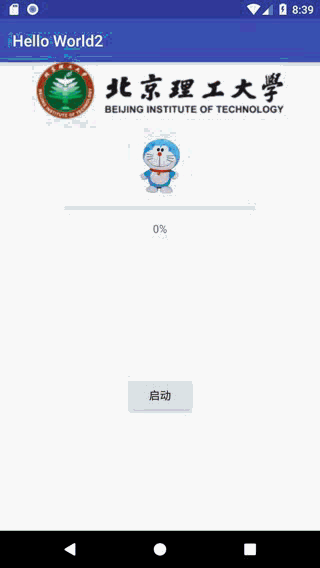

# HOMEWORK_20190118

* 1.实现效果

<p align="center">
    
    <p align="center">
        <em>exercise1 demo</em>
    </p>
</p>

* 2.使用的组件：

* TextVeiw
```xml
<TextView
        android:id="@+id/chatText"
        android:layout_width="0dp"
        android:layout_height="0dp"
        android:layout_marginBottom="19dp"
        android:layout_marginEnd="63dp"
        android:layout_marginStart="63dp"
        android:gravity="center_horizontal"
        android:text="Hello World!"
        android:visibility="invisible"
        app:layout_constraintBottom_toTopOf="@+id/questionText"
        app:layout_constraintEnd_toEndOf="parent"
        app:layout_constraintStart_toStartOf="parent"
        app:layout_constraintTop_toBottomOf="@+id/progressText" />
```

** Button

EditText

ImageView 

RadioButton

RadioGroup

progressBar(Horizontal)

* 3.APP功能：

编写了一个对话机器人，可以用来与用户进行简单的交互，为用户计算出输入的表达式的值。并使用progressBar模拟程序加载。

