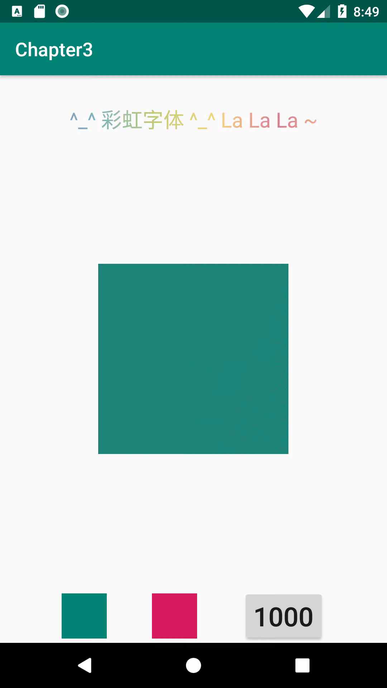

# HOMEWORK_20190121
## 1、Exercise1
* 实现效果
<p align="center">
    
    <p align="center">
        <em>exercise1 demo</em>
    </p>
</p>
* 实现方法：

（1）	在build.gradle中：implementation "com.airbnb.android:lottie:2.7.0"。

```gradle
dependencies {
    implementation fileTree(dir: 'libs', include: ['*.jar'])
    implementation 'com.android.support:appcompat-v7:28.0.0'
    implementation "com.airbnb.android:lottie:2.7.0"
    // TODO 1: 添加对 lottie android 库的依赖. 注意版本使用 2.7.0
    // lottie Android 官网：https://airbnb.io/lottie/android/android.html
}
```
（2）	在activity_main中，加入lottie的定义，设置ID，rawRes,循环等属性。
```xml
<com.airbnb.lottie.LottieAnimationView
        android:id="@+id/animation_view"
        android:layout_width="wrap_content"
        android:layout_height="wrap_content"
        app:lottie_rawRes="@raw/material_wave_loading"
        app:lottie_loop="true"
        app:lottie_autoPlay="false" />

```
（3）	在MainActivity中，根据seekBar的progress，对其比例进行计算，然后设置动画播放的进度。
```xml
@Override
            public void onProgressChanged(final SeekBar seekBar, final int progress, boolean fromUser) {
                // TODO 3: 这里应该调用哪个函数呢
                // 提示1：可以参考 https://airbnb.io/lottie/android/android.html#custom-animators
                // 提示2：SeekBar 的文档可以把鼠标放在 OnProgressChanged 中间，并点击 F1 查看，
                // 或者到官网查询 https://developer.android.com/reference/android/widget/SeekBar.OnSeekBarChangeListener.html#onProgressChanged(android.widget.SeekBar,%20int,%20boolean)
                //直接设置动画进度为Progeress/seekBar的最大值
                animationView.setProgress((float)progress/seekBar.getMax());
            }
```

## 二、Exercise2
* 实现效果
<p align="center">
    
    <p align="center">
        <em>exercise1 demo</em>
    </p>
</p>
* 实现方法

**第一种方法：

利用ObjectAnimator，同时定义ScaleX，ScaleY，Alpha属性，然后将其加入animatorSet的playTogether方法中进行同时播放。
```java
//TODO：第一种方法，利用ObjectAnimator进行实现
        // 在这里实现了一个 ObjectAnimator，对 target 控件的背景色进行修改
        // 可以思考下，这里为什么要使用 ofArgb，而不是 ofInt 呢？
        ObjectAnimator animator1 = ObjectAnimator.ofArgb(target,
                "backgroundColor",
                getBackgroundColor(startColorPicker),
                getBackgroundColor(endColorPicker));
        animator1.setDuration(Integer.parseInt(durationSelector.getText().toString()));
        animator1.setRepeatCount(ObjectAnimator.INFINITE);
        animator1.setRepeatMode(ObjectAnimator.REVERSE);

        // TODO 1：在这里实现另一个 ObjectAnimator，对 target 控件的大小进行缩放，从 1 到 2 循环
        ObjectAnimator animator_scaleX = ObjectAnimator.ofFloat(target,
                "scaleX",
                1,
                        2);
        ObjectAnimator animator_scaleY = ObjectAnimator.ofFloat(target,
                "scaleY",
                1,
                2);
        animator_scaleX.setDuration(Integer.parseInt(durationSelector.getText().toString()));
        animator_scaleX.setRepeatCount(ObjectAnimator.INFINITE);
        animator_scaleX.setRepeatMode(ObjectAnimator.REVERSE);
        animator_scaleY.setDuration(Integer.parseInt(durationSelector.getText().toString()));
        animator_scaleY.setRepeatCount(ObjectAnimator.INFINITE);
        animator_scaleY.setRepeatMode(ObjectAnimator.REVERSE);

        // TODO 2：在这里实现另一个 ObjectAnimator，对 target 控件的透明度进行修改，从 1 到 0.5f 循环
        ObjectAnimator animator_alpha = ObjectAnimator.ofFloat(target,
                "alpha",
                1f,
                        0.5f);
        animator_alpha.setDuration(Integer.parseInt(durationSelector.getText().toString()));
        animator_alpha.setRepeatCount(ObjectAnimator.INFINITE);
        animator_alpha.setRepeatMode(ObjectAnimator.REVERSE);
        // TODO 3: 将上面创建的其他 ObjectAnimator 都添加到 AnimatorSet 中
        animatorSet = new AnimatorSet();
        animatorSet.playTogether(animator1, animator_scaleX, animator_scaleY, animator_alpha);
        animatorSet.start();
```
**第二种方法：

利用ValueAnimator，定义0,1之间的数值发生器，并将其映射为背景、ScaleX，ScaleY，Alpha的值，然后进行展示。
```java
//建立一个从0到1的ValueAnimator
        ValueAnimator anim = ValueAnimator.ofFloat(0f, 1f);
        anim.setDuration(Integer.parseInt(durationSelector.getText().toString()));
        anim.setRepeatCount(ObjectAnimator.INFINITE);
        anim.setRepeatMode(ValueAnimator.REVERSE);
        anim.addUpdateListener(new ValueAnimator.AnimatorUpdateListener() {
            @Override
            public void onAnimationUpdate(ValueAnimator animation) {
                float currentValue = (float)animation.getAnimatedValue();
                System.out.println(currentValue);
                //将当前值映射为对应的需要改变的值
                //对于背景颜色
                int start_color = getBackgroundColor(startColorPicker);
                int end_color = getBackgroundColor(endColorPicker);
                int back_color = start_color;
                //对于颜色的调控不够准确
                //TODO：需要进行更多的文档查阅
                if(start_color != end_color){
                    back_color = (int)(currentValue*(float)(end_color-start_color)) + start_color;
                }
                target.setBackgroundColor(back_color);

                //对于大小
                double target_scaleX = currentValue + 1.0;
                double target_scaleY = currentValue + 1.0;
                target.setScaleX((float)target_scaleX);
                target.setScaleY((float)target_scaleY);
                //对于透明度
                double target_alpha = -0.5*(currentValue-2.0);
                target.setAlpha(1f);
            }
        });
        anim.start();
```
