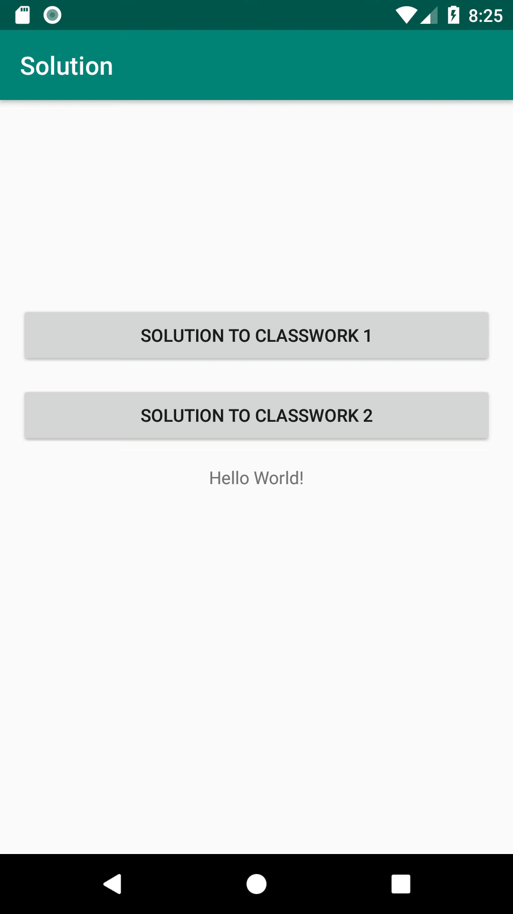

#HOMEWORK_20190122

## 1.Exercise1

* 实现效果
<p align="center">
    
    <p align="center">
        <em>exercise1 demo</em>
    </p>
</p>
* 实现方法

**1.实现Cat类的解析
```java
public class Cat {
    // TODO-C1 (1) Implement your Cat Bean here according to the response json
    // 单条内容
    // {"breeds": [],"categories": [{"id": 2,"name": "space"}],"id": "5o","url": "https://cdn2.thecatapi.com/images/5o.gif"}
    @SerializedName("id") private String id;
    @SerializedName("url") private String url;
    @SerializedName("categories") private List<Category> categories;
    //取得ID
    public String getId(){
        return id;
    }
    //设置ID
    public void setId(String id){
        this.id = id;
    }
    //取得url
    public String getUrl(){
        return url;
    }
    //设置url
    public void setUrl(String url){
        this.url = url;
    }

    public List<Category> getCategories() {
        return categories;
    }

    //设置Categorie类
    public static class Category {
        /**
         * [0]
         * id : 2
         * name : space
         */
        @SerializedName("id") private int id;
        @SerializedName("name") private String name;

        public int getId() {
            return id;
        }

        public void setId(int id) {
            this.id = id;
        }

        public String getName(){
            return name;
        }

        public void setName(String name){
            this.name = name;
        }

        @Override public String toString() {
            return "Categorie{" +
                    "id=" + id +
                    ", name='" + name +
                    "}";
        }
    }

    @Override public String toString() {
        return "Cat{" +
                "id='" + id +'\'' +
                ", url='" + url + '\'' +
                ", categories=" + categories +
                '}';
    }

}
```
**2.实现ICatService的interface,注意参数为List
```java
public interface ICatService {
    // TODO-C1 (2) Implement your Cat Request here, url: https://api.thecatapi.com/v1/images/search?limit=5
    @GET("v1/images/search?limit=5") Call<Cat[]> randomCat();
}
```
**3.实现requestData方法，
***在NetworkUtils中实现getResponseWithRetrofitAsync_Feed方法
```java
//实现getResponseWithRetrofitAsync方法用来请求Feed数据
    public static void getResponseWithRetrofitAsync_Feed(Callback<FeedResponse> callback) {
        Retrofit retrofit = new Retrofit.Builder()
                .baseUrl("http://10.108.10.39:8080/")
                .addConverterFactory(GsonConverterFactory.create())
                .build();

        retrofit.create(IMiniDouyinService.class).allFeed().
                enqueue(callback);
    }
```
***调用它，并定义回调函数
```java
NetworkUtils.getResponseWithRetrofitAsync_Cat(new Callback<Cat[]>() {
            @Override public void onResponse(Call<Cat[]> call, Response<Cat[]> response) {
                //接收到返回值，开始进行处理。
                List<Cat> cats = new ArrayList<>(Arrays.asList(response.body()));
                loadPics(cats);
                restoreBtn();
            }

            @Override public void onFailure(Call<Cat[]> call, Throwable t) {
                Toast.makeText(Solution2C1Activity.this.getApplicationContext(), t.getMessage(), Toast.LENGTH_LONG).show();
            }
        });
```
## 2.Exercise2

* 实现效果
<p align="center">
    
    <p align="center">
        <em>exercise2 demo</em>
    </p>
</p>
* 实现方法
**1.实现Feed的解析
```java
public class Feed {

    // TODO-C2 (1) Implement your Feed Bean here according to the response json
    //{ "student_id": "3220180826", "user_name": "lq", "image_url": "www", "video_url":"www"}
    @SerializedName("student_id") private String student_id;
    @SerializedName("user_name") private String user_name;
    @SerializedName("image_url") private String image_url;
    @SerializedName("video_url") private String video_url;
    public String getStudent_id(){
        return student_id;
    }

    public String getUser_name(){
        return user_name;
    }

    public String getImage_url(){
        return image_url;
    }

    public String getVideo_url(){
        return video_url;
    }

    @Override public String toString() {
        return "Feed{" +
                "student_id='" + student_id +'\'' +
                ", user_name='" + user_name + '\'' +
                ", image_url=" + image_url + '\'' +
                ", video_url=" + video_url +
                '}';
    }
}
```
**2.实现FeedResponse的解析
```java
public class FeedResponse {

    // TODO-C2 (2) Implement your FeedResponse Bean here according to the response json
    @SerializedName("success") private boolean success;
    @SerializedName("feeds") private List<Feed> feeds;
    public boolean isSuccess(){
        return success;
    }

    public List<Feed> getFeeds(){
        return feeds;
    }

    @Override public String toString() {
        return "Feeds{" +
                "success='" + success +'\'' +
                ", feeds=" + feeds.toString() +
                '}';
    }
}
```
**3.实现PostVideoResponse的解析
```java
public class PostVideoResponse {

    // TODO-C2 (3) Implement your PostVideoResponse Bean here according to the response json
    //{"success":true, "item"{"student_id":"123", "user_name":"123", "image_url":"www", "video_url":"www"}}
    @SerializedName("success") boolean success;
    @SerializedName("item") Item item;

    public boolean IsSuccess(){
        return success;
    }

    public Item getItem(){
        return item;
    }

    public static class Item{
        @SerializedName("student_id") String student_id;
        @SerializedName("user_name") String user_name;
        @SerializedName("image_url") String image_url;
        @SerializedName("video_url") String video_url;
        public String getStudent_id(){
            return student_id;
        }

        public String getUser_name(){
            return user_name;
        }

        public String getImage_url(){
            return image_url;
        }

        public String getVideo_url(){
            return video_url;
        }


        @Override public String toString() {
            return "Item{" +
                    "student_id'" + student_id +
                    ", user_name=" + user_name +
                    ", image_url=" + image_url +
                    ", video_url=" + video_url +
                    '}';
        }
    }

    @Override public String toString() {
        return "PostVideoResponse{" +
                "success'" + success +
                ", item=" + item.toString() +
                '}';
    }
}

```
**4.实现调用选择图片和视频的系统接口
```java
public void chooseImage() {
        // TODO-C2 (4) Start Activity to select an image
        //选择图片
        Intent intent = new Intent();
        intent.setType("image/*");
        intent.setAction(Intent.ACTION_GET_CONTENT);
        startActivityForResult(Intent.createChooser(intent, "Select Picture"),
                PICK_IMAGE);
    }


    public void chooseVideo() {
        // TODO-C2 (5) Start Activity to select a video
        //选择视频
        Intent intent = new Intent();
        intent.setType("video/*");
        intent.setAction(Intent.ACTION_GET_CONTENT);
        startActivityForResult(Intent.createChooser(intent, "Select Video"),
                PICK_VIDEO);
    }
```
**5.进行视频上传，将所有需要的信息进行处理后上传，注意文件的处理。
```java
private void postVideo() {
        mBtn.setText("POSTING...");
        mBtn.setEnabled(false);

        // TODO-C2 (6) Send Request to post a video with its cover image
        // if success, make a text Toast and show
        //将所有需要的信息打包进行传递
        String student_id = "2120171098";
        String user_name = "zsf";
        MultipartBody.Part upload_image = getMultipartFromUri("cover_image", mSelectedImage);
        MultipartBody.Part upload_video = getMultipartFromUri("video", mSelectedVideo);

        Callback<PostVideoResponse> callback = new Callback<PostVideoResponse>() {
            @Override public void onResponse(Call<PostVideoResponse> call, Response<PostVideoResponse> response) {
                //接收到返回值，开始进行处理。
                PostVideoResponse rs = response.body();
                if(rs.IsSuccess()){
                    //发送成功
                    Toast.makeText(Solution2C2Activity.this, "发送成功！", Toast.LENGTH_SHORT).show();
                    resetSendBtn();
                } else {
                    Toast.makeText(Solution2C2Activity.this, "因某种原因，发送失败！", Toast.LENGTH_SHORT).show();
                }
            }
            @Override public void onFailure(Call<PostVideoResponse> call, Throwable t) {
                Toast.makeText(Solution2C2Activity.this.getApplicationContext(), t.getMessage(), Toast.LENGTH_LONG).show();
            }
        };
        Retrofit retrofit = new Retrofit.Builder()
                    .baseUrl("http://10.108.10.39:8080/")
                    .addConverterFactory(GsonConverterFactory.create())
                    .build();
        retrofit.create(IMiniDouyinService.class).postVideo(student_id, user_name, upload_image, upload_video).
                enqueue(callback);
    }
```
**6.实现IMiniDouyinService的服务。
```java
public interface IMiniDouyinService {
    // TODO-C2 (7) Implement your MiniDouyin PostVideo Request here, url: (POST) http://10.108.10.39:8080/minidouyin/video
    // TODO-C2 (8) Implement your MiniDouyin Feed Request here, url: http://10.108.10.39:8080/minidouyin/feed
    @Multipart
    @POST("minidouyin/video") Call<PostVideoResponse> postVideo(
            @Query("student_id") String student_id,
            @Query("user_name") String username,
            @Part MultipartBody.Part file1,
            @Part MultipartBody.Part file2
            );
    @GET("minidouyin/feed") Call<FeedResponse> allFeed();
}
```
**7.实现请求刷新图片的接口
```java
public void fetchFeed(View view) {
        mBtnRefresh.setText("requesting...");
        mBtnRefresh.setEnabled(false);

        // TODO-C2 (9) Send Request to fetch feed
        // if success, assign data to mFeeds and call mRv.getAdapter().notifyDataSetChanged()
        // don't forget to call resetRefreshBtn() after response received
        NetworkUtils.getResponseWithRetrofitAsync_Feed(new Callback<FeedResponse>() {
            @Override public void onResponse(Call<FeedResponse> call, Response<FeedResponse> response) {
                //接收到返回值，开始进行处理。
                FeedResponse feeds = response.body();
                mFeeds = feeds.getFeeds();
                mRv.getAdapter().notifyDataSetChanged();
                resetRefreshBtn();
            }

            @Override public void onFailure(Call<FeedResponse> call, Throwable t) {
                Toast.makeText(Solution2C2Activity.this.getApplicationContext(), t.getMessage(), Toast.LENGTH_LONG).show();
            }
        });
    }
```
**8.将图片展示在屏幕中
```java
@Override
            public void onBindViewHolder(@NonNull RecyclerView.ViewHolder viewHolder, int i) {
                ImageView iv = (ImageView) viewHolder.itemView;

                // TODO-C2 (10) Uncomment these 2 lines, assign image url of Feed to this url variable
                String url = mFeeds.get(i).getImage_url();
                Glide.with(iv.getContext()).load(url).into(iv);
            }
```
