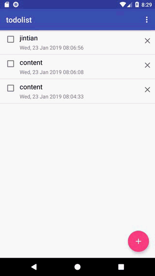
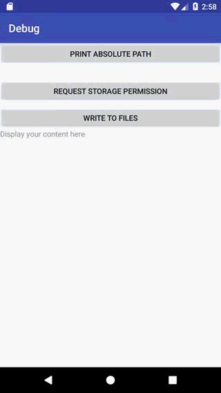

# Basic And Enhanced Readme

# Basic

## 1.实现效果

* 添加Note
<p align="center">
    
    <p align="center">
        <em>添加Note</em>
    </p>
</p>
* 更改完成状态
<p align="center">
    
    <p align="center">
        <em>更改完成状态</em>
    </p>
</p>
* 删除Note
<p align="center">
    
    <p align="center">
        <em>删除Note</em>
    </p>
</p>
## 2.实现方法

* 1.完成TodoContract类，定义了列名。
```java
public static class Todo implements BaseColumns{
        //定义表名
        public static final String TABLE_NAME = "todo5";
        public static final String COLUMN_NAME_DATE = "date";
        public static final String COLUMN_NAME_STATE = "state";
        public static final String COLUMN_NAME_CONTENT = "content";
    }
```
* 2.定义了创建表和删除表的语句，
```java
// TODO 1 定义表结构和 SQL 语句常量
    //创建数据库，设置ID为自增的
    public static final String SQL_CREATE_ENTRIES =
            "CREATE TABLE " + Todo.TABLE_NAME + " (" +
                    Todo._ID + " INTEGER PRIMARY KEY AUTOINCREMENT," +
                    Todo.COLUMN_NAME_DATE + " LONG, " +
                    Todo.COLUMN_NAME_STATE + " INTEGER, " +
                    Todo.COLUMN_NAME_CONTENT + " TEXT)";
    //删除数据库
    public static final String SQL_DELETE_ENTRIES =
            "DROP TABLE IF EXISTS " + Todo.TABLE_NAME;

    private TodoContract() {

    }
```
* 3.完成TodoDbHelper的onCreate方法
```java
@Override
    public void onCreate(SQLiteDatabase db) {
        try{
            //执行SQL语句
            db.execSQL(TodoContract.SQL_CREATE_ENTRIES);
            Log.d(TAG, "Create Success");
        } catch (Exception e){
            Log.d(TAG, "Create Error!");
            e.printStackTrace();
        }
    }
```
* 4.在NoteActivity界面添加TodoDbHelper和SQLiteDatabase的定义、实现及释放
```java
//定义DbHelper对象和数据库引用对象
    private TodoDbHelper mDbHelper;
    private SQLiteDatabase db;
    
//取得数据库
        mDbHelper = new TodoDbHelper(getApplicationContext());
        db = mDbHelper.getWritableDatabase();
        
@Override
    protected void onDestroy() {
        mDbHelper.close();
        super.onDestroy();
    }
```
* 5.完成插入方法
```java
private boolean saveNote2Database(String content) {
        // TODO 3 插入一条新数据，返回是否插入成功
        try{
            //建立一个ContentValues对象
            ContentValues values = new ContentValues();
            //插入时间date，状态state，内容content
            values.put(TodoContract.Todo.COLUMN_NAME_DATE, System.currentTimeMillis());
            values.put(TodoContract.Todo.COLUMN_NAME_STATE, 0);
            values.put(TodoContract.Todo.COLUMN_NAME_CONTENT, content);
            long new_id = db.insert(TodoContract.Todo.TABLE_NAME, null, values);
            if(new_id >= 0)
            {
                return true;
            }
        } catch (Exception e){
            Log.d(TAG, "Insert Error!");
            e.printStackTrace();
        }
        return false;
    }
```
* 6.根据之前定义的数据库列及类型，完成数据库的获取数据方法
```java
// TODO 4 从数据库中查询数据，并转换成 JavaBeans
        //如果db为null
        if(db_read == null){
            return Collections.emptyList();
        }
        List<Note> result = new LinkedList<>();
        //数据库的指针
        Cursor cursor = null;
        try {
            cursor = db_read.query(TodoContract.Todo.TABLE_NAME,
                    new String[]{TodoContract.Todo._ID,
                            TodoContract.Todo.COLUMN_NAME_DATE,
                            TodoContract.Todo.COLUMN_NAME_STATE,
                            TodoContract.Todo.COLUMN_NAME_CONTENT},
                    null, null,
                    null, null,
                    TodoContract.Todo.COLUMN_NAME_DATE+" DESC");
            //开始获取数据
            while (cursor.moveToNext()) {
                //取得id
                int id = cursor.getInt(cursor.getColumnIndex(TodoContract.Todo._ID));
                //将时间转换回来
                long date_mills = cursor.getLong(cursor.getColumnIndex(TodoContract.Todo.COLUMN_NAME_DATE));
                Date date = new Date(date_mills);
                //创建State对象
                int int_state = cursor.getInt(cursor.getColumnIndex(TodoContract.Todo.COLUMN_NAME_STATE));
                State state = State.from(int_state);
                //获得content
                String content = cursor.getString(cursor.getColumnIndex(TodoContract.Todo.COLUMN_NAME_CONTENT));
                //根据之前的内容，建立Node
                Note note = new Note(id);
                note.setContent(content);
                note.setDate(date);
                note.setState(state);
                //添加入result
                result.add(note);
            }
            return result;
        } catch (Exception e){
            Log.d(TAG, "查询失败");
            e.printStackTrace();
        }
        return null;
```
* 7.实现点击复选框时state状态的更新
```java
private void updateNode(Note note) {
        // 更新数据
        //根据ID更新内容
        try{
            //取得需要更新的ID
            long id = note.id;
            ContentValues values = new ContentValues();
            values.put("state", note.getState().intValue);
            //构建筛选规则
            String selection = TodoContract.Todo._ID + " LIKE ?";
            String[] selection_args = {Long.toString(id)};
            int count = db_write.update(
                    TodoContract.Todo.TABLE_NAME,
                    values,
                    selection,
                    selection_args);
            if(count >= 0){
                Log.d(TAG, "Update Success");
                notesAdapter.refresh(loadNotesFromDatabase());
                recyclerView.setAdapter(notesAdapter);
            }
        } catch (Exception e){
            Log.d(TAG, "Update Error!");
            e.printStackTrace();
        }

    }
```
* 8.实现数据的删除
```java
private void deleteNote(Note note) {
        // TODO 删除数据
        //根据ID删除数据
        try{
            //取得要删除的id
            long id = note.id;
            String selection = TodoContract.Todo._ID + " LIKE ?";
            String[] selection_args = {Long.toString(id)};
            int count = db_write.delete(
                    TodoContract.Todo.TABLE_NAME,
                    selection,
                    selection_args);
            if(count >= 0){
                Log.d(TAG, "Delete Success!");
                notesAdapter.refresh(loadNotesFromDatabase());
                recyclerView.setAdapter(notesAdapter);
            }
        } catch (Exception e){
            Log.d(TAG, "Delete Error!");
            e.printStackTrace();
        }
    }
```
# Enhanced

## 1.实现效果

* 添加Note
<p align="center">
    
    <p align="center">
        <em>添加Note</em>
    </p>
</p>
* 更改完成状态及删除
<p align="center">
    
    <p align="center">
        <em>更改完成状态及删除</em>
    </p>
</p>
* 写入文件
<p align="center">
    
    <p align="center">
        <em>写入文件</em>
    </p>
</p>
## 2.实现方法

* 1.在Todo中增加优先级列名的定义
```java
public static class Todo implements BaseColumns{
        //定义表名
        public static final String TABLE_NAME = "todo5";
        public static final String COLUMN_NAME_DATE = "date";
        public static final String COLUMN_NAME_STATE = "state";
        public static final String COLUMN_NAME_CONTENT = "content";
        public static final String COLUMN_NAME_PRIORITY = "priority";
    }
```
* 2.在TodoDbHelper中增加版本号，实现OnUpgrade方法
```java
for (int i = oldVersion; i < newVersion; i++){
            switch (i){
                case 1:
                    try{
                        db.execSQL("ALTER TABLE " + TodoContract.Todo.TABLE_NAME + " ADD "
                        + TodoContract.Todo.COLUMN_NAME_PRIORITY + " INTEGER");
                        Log.d(TAG, "Upgrade Success!");
                    } catch (Exception e){
                        Log.d(TAG, "onUpgrade() called with: db = [" + db + "], oldVersion = [" + oldVersion + "], newVersion = [" + newVersion + "]");
                        e.printStackTrace();
                    }
                    break;
                default:
                    break;
            }
        }
```
* 3.修改Note的定义，增加priority属性
```java
    public final long id;
    private Date date;
    private State state;
    private String content;
    private int priority;
    
    public int getPriority(){
        return priority;
    }

    public void setPriority(int priority){
        this.priority = priority;
    }
```
* 4.在activity_main.xml中增加Spinner组件用来对优先级进行选择，并建立spingarr.xml为其提供数据。
```xml
<LinearLayout
        android:layout_width="match_parent"
        android:layout_height="wrap_content">

        <TextView
            android:layout_width="match_parent"
            android:layout_height="match_parent"
            android:layout_weight="1"
            android:gravity="center"
            android:textSize="20sp"
            android:textStyle="bold"
            android:tooltipText="abccc"
            android:text="请选择事件的优先级：" />
        <Spinner
            android:layout_width="match_parent"
            android:layout_height="match_parent"
            android:id="@+id/priority_view"
            android:layout_weight="2"
            android:gravity="center"
            android:entries="@array/spingarr"></Spinner>
    </LinearLayout>
```
```xml
<?xml version="1.0" encoding="utf-8"?>
<resources>
    <string-array name="spingarr">
        <item>重要</item>
        <item>适度</item>
        <item>宽裕</item>
    </string-array>
</resources>
```
* 5.在NoteActivity中增加获取下拉框的值的代码
```java
//取得优先级框
        priority_view = findViewById(R.id.priority_view);
        editText = findViewById(R.id.edit_text);
        editText.setFocusable(true);
        editText.requestFocus();
        InputMethodManager inputManager = (InputMethodManager)
                getSystemService(Context.INPUT_METHOD_SERVICE);
        if (inputManager != null) {
            inputManager.showSoftInput(editText, 0);
        }
```
* 6.判断完成后，将优先级也作为参数进行返回
```java
String priority = priority_view.getSelectedItem().toString();
                int pri = 0;
                switch (priority){
                    case "重要":pri = 3;break;
                    case "适度":pri = 2;break;
                    case "宽裕":pri = 1;break;
                }
                if (pri == 0){
                    Toast.makeText(NoteActivity.this,
                            "No Priority to add", Toast.LENGTH_SHORT).show();
                    return;
                }
```
* 7.修改插入数据库的代码，增加插入优先级
```java
private boolean saveNote2Database(String content, int priority) {
        // TODO 3 插入一条新数据，返回是否插入成功
        try{
            //建立一个ContentValues对象
            ContentValues values = new ContentValues();
            //插入时间date，状态state，内容content
            values.put(TodoContract.Todo.COLUMN_NAME_DATE, System.currentTimeMillis());
            values.put(TodoContract.Todo.COLUMN_NAME_STATE, 0);
            values.put(TodoContract.Todo.COLUMN_NAME_CONTENT, content);
            values.put(TodoContract.Todo.COLUMN_NAME_PRIORITY, priority);
            long new_id = db.insert(TodoContract.Todo.TABLE_NAME, null, values);
            if(new_id >= 0) {
                Log.d(TAG, "Insert Success!");
                return true;
            }
        } catch (Exception e){
            Log.d(TAG, "Insert Error!");
            e.printStackTrace();
        }
        return false;
    }
```
* 8.对查询操作进行按照优先级降序排序
```java
cursor = db_read.query(TodoContract.Todo.TABLE_NAME,
                    new String[]{TodoContract.Todo._ID,
                            TodoContract.Todo.COLUMN_NAME_DATE,
                            TodoContract.Todo.COLUMN_NAME_STATE,
                            TodoContract.Todo.COLUMN_NAME_CONTENT,
                            TodoContract.Todo.COLUMN_NAME_PRIORITY},
                    null, null,
                    null, null,
                            TodoContract.Todo.COLUMN_NAME_PRIORITY+" DESC"
                            );
```
* 9.修改数据库查询的代码，增加获取优先级列
```java
while (cursor.moveToNext()) {
                //取得id
                int id = cursor.getInt(cursor.getColumnIndex(TodoContract.Todo._ID));
                //将时间转换回来
                long date_mills = cursor.getLong(cursor.getColumnIndex(TodoContract.Todo.COLUMN_NAME_DATE));
                Date date = new Date(date_mills);
                //创建State对象
                int int_state = cursor.getInt(cursor.getColumnIndex(TodoContract.Todo.COLUMN_NAME_STATE));
                State state = State.from(int_state);
                //获得content
                String content = cursor.getString(cursor.getColumnIndex(TodoContract.Todo.COLUMN_NAME_CONTENT));
                //获得priority
                int priority = cursor.getInt(cursor.getColumnIndex(TodoContract.Todo.COLUMN_NAME_PRIORITY));
                //根据之前的内容，建立Node
                Note note = new Note(id);
                note.setDate(date);
                note.setState(state);
                note.setContent(content);
                note.setPriority(priority);
                //添加入result
                result.add(note);
            }
```
* 10.对NoteViewHolder进行修改，更新时根据Note的priority进行背景色修改
```java
//设置背景颜色
        int priority = note.getPriority();
        if(priority == 3){
            back.setBackgroundColor(Color.parseColor("#FF6347"));
        } else if(priority == 2) {
            back.setBackgroundColor(Color.parseColor("#FFA500"));
        } else {
            back.setBackgroundColor(Color.parseColor("#FFF68F"));
        }
```
* 11.在DebugActivity中，选择内部私有空间的位置，建立文件，进行写入，并读取。利用FileWriter,BufferedWritter,FileReader,BufferedReader实现。
```java
 //写入文件
                //取得路径
                try{
                    //建立FileWriter,FileReader,BufferedWriter,BufferedReader;
                    String show_content = "";
                    File write_file = new File(getFilesDir().toString(), "test.txt");

                    String content = "测试：写入文件";
                    FileWriter fw = null;
                    BufferedWriter bw = null;
                    FileReader fr = null;

                    BufferedReader br = null;
                    fw = new FileWriter(write_file.getAbsoluteFile(), false);
                    bw = new BufferedWriter(fw);
                    bw.write(content);
                    Log.d(TAG, "写入成功");
                    bw.close();
                    //读取文件
                    fr = new FileReader(write_file);
                    br = new BufferedReader(fr);
                    String temp;
                    while((temp = br.readLine()) != null){
                        show_content += temp.toString();
                    }
                    br.close();
                    fileText.setText(show_content);
                } catch (Exception e){
                    e.printStackTrace();
                }
```
