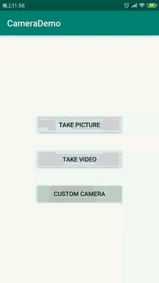

# HOMEWORK_20190124_Camera（有点不清晰，使用AndroidStudio进行录制，格式工厂转为GIF。）
## 1.实现效果
* 调用系统相机进行拍照
<p align="center">
    
    <p align="center">
        <em>带封面视频及详情跳转</em>
    </p>
</p>
* 调用系统相机进行视频录制
<p align="center">
    
    <p align="center">
        <em>视频列表自动播放</em>
    </p>
</p>
* 调用Camera实现自动对焦
<p align="center">
    
    <p align="center">
        <em>视频列表自动播放</em>
    </p>
</p>
* 调用Camera进行拍照
<p align="center">
    
    <p align="center">
        <em>视频列表自动播放</em>
    </p>
</p>
* 调用Camera进行视频录制
<p align="center">
    
    <p align="center">
        <em>视频列表自动播放</em>
    </p>
</p>
* 调用Camera进行摄像头切换
<p align="center">
    
    <p align="center">
        <em>视频列表自动播放</em>
    </p>
</p>
* 调用Camera打开闪光灯及镜头对焦
<p align="center">
    
    <p align="center">
        <em>视频列表自动播放</em>
    </p>
</p>
## 2.实现方法
* 1.动态权限申请
```java
if (ContextCompat.checkSelfPermission(TakePictureActivity.this,
                    Manifest.permission.WRITE_EXTERNAL_STORAGE) != PackageManager.PERMISSION_GRANTED
                    || ContextCompat.checkSelfPermission(TakePictureActivity.this,
                    Manifest.permission.CAMERA) != PackageManager.PERMISSION_GRANTED) {
                //todo 在这里申请相机、存储的权限
               try{
                   ActivityCompat.requestPermissions(this,
                           new String[]{Manifest.permission.CAMERA, Manifest.permission.WRITE_EXTERNAL_STORAGE},
                           REQUEST_EXTERNAL_STORAGE);
               } catch (Exception e){
                   Log.d(TAG, "申请权限错误！");
                   e.printStackTrace();
               }
            } else {
                takePicture();
            }
```
* 2.申请结果
```java
switch (requestCode) {
            case REQUEST_EXTERNAL_STORAGE: {
                //todo 判断存储权限是否已经授予
                if(grantResults.length == 2 &&
                        grantResults[0] == PackageManager.PERMISSION_GRANTED &&
                        grantResults[1] == PackageManager.PERMISSION_GRANTED) {
                    takePicture();
                }
                break;
            }
        }
```
* 3.直接调用系统摄像头
```java
private void takePicture() {
        //todo 打开相机
        try{
            //调用相机
            Intent takePictureIntent = new Intent(MediaStore.ACTION_IMAGE_CAPTURE);
            imgFile = Utils.getOutputMediaFile(Utils.MEDIA_TYPE_IMAGE);
            if(imgFile != null){
                Uri fileUri = FileProvider.getUriForFile(this,"com.bytedance.camera.demo", imgFile);
                takePictureIntent.putExtra(MediaStore.EXTRA_OUTPUT, fileUri);
                startActivityForResult(takePictureIntent, REQUEST_IMAGE_CAPTURE);
            }
        } catch (Exception e){
            Log.d(TAG, "打开相机失败");
            e.printStackTrace();
        }
    }
```
* 4.保存的文件在屏幕上预览，进行旋转与剪裁。
```java
private void setPic() {
        //todo 根据imageView裁剪
        int targetW = imageView.getWidth();
        int targetH = imageView.getHeight();
        BitmapFactory.Options bmOptions = new BitmapFactory.Options();
        bmOptions.inJustDecodeBounds = true;
        BitmapFactory.decodeFile(imgFile.getAbsolutePath(), bmOptions);
        int photoW = bmOptions.outWidth;
        int photoH = bmOptions.outHeight;
        //todo 根据缩放比例读取文件，生成Bitmap
        int scaleFactor = Math.min(photoW / targetW, photoH / targetH);
        bmOptions.inJustDecodeBounds = false;
        bmOptions.inSampleSize = scaleFactor;
        bmOptions.inPurgeable = true;
        //todo 如果存在预览方向改变，进行图片旋转
        String filepath = imgFile.getAbsolutePath();
        //这种情况下会旋转90度
//        Bitmap bmp = BitmapFactory.decodeFile(filepath, bmOptions);
        Bitmap bmp = Utils.rotateImage(BitmapFactory.decodeFile(filepath, bmOptions), filepath);
        imageView.setImageBitmap(bmp);
    }
```
* 5.调用系统相机进行录制并播放在屏幕上
```java
private void Record(){
        Intent takeVideoIntent = new Intent(MediaStore.ACTION_VIDEO_CAPTURE);
        if (takeVideoIntent.resolveActivity(getPackageManager()) != null ){
            startActivityForResult(takeVideoIntent, REQUEST_VIDEO_CAPTURE);
        }
    }
    
@Override
    protected void onActivityResult(int requestCode, int resultCode, Intent intent) {
        if (requestCode == REQUEST_VIDEO_CAPTURE && resultCode == RESULT_OK) {
            //todo 播放刚才录制的视频
            Uri videoUri = intent.getData();
            videoView.setVideoURI(videoUri);
            videoView.start();
        }
    }
```
* 6.建立Camera及对应的SurfaceView
```java
//设置摄像头
        mCamera = getCamera(CAMERA_TYPE);

        mSurfaceView = findViewById(R.id.img);
        surfaceHolder = mSurfaceView.getHolder();
        //设置SurfaceHolder
        surfaceHolder.setType(SurfaceHolder.SURFACE_TYPE_PUSH_BUFFERS);
        surfaceHolder.addCallback(this);
```
* 7.为Camera实现自动对焦
```java
public Camera getCamera(int position) {
        CAMERA_TYPE = position;
        if (mCamera != null) {
            releaseCameraAndPreview();
        }
        Camera cam = Camera.open(position);

        //todo 摄像头添加属性，例是否自动对焦，设置旋转方向等
        //自动对焦
        Camera.Parameters params = cam.getParameters();
        List<String> focusModes = params.getSupportedFocusModes();
        if (focusModes.contains(Camera.Parameters.FOCUS_MODE_CONTINUOUS_VIDEO)){
            params.setFocusMode(Camera.Parameters.FOCUS_MODE_CONTINUOUS_VIDEO);
            cam.setParameters(params);
        }
        //旋转方向
        rotationDegree = getCameraDisplayOrientation(CAMERA_TYPE_BACK);
        cam.setDisplayOrientation(rotationDegree);
        return cam;
    }
```
* 8.利用Camera拍一张照片
```java
findViewById(R.id.btn_picture).setOnClickListener(v -> {
            //todo 拍一张照片
            mCamera.takePicture(null, null, mPicture);
        });
```
* 9.利用Camera进行录制,此处用了MediaRecorder，需要特别注意其状态的改变。
```java
findViewById(R.id.btn_record).setOnClickListener(v -> {
            //todo 录制，第一次点击是start，第二次点击是stop
            if (isRecording) {
                //todo 停止录制
                isRecording = false;
                mMediaRecorder.stop();
                mMediaRecorder.reset();
                releaseMediaRecorder();
                mMediaRecorder = null;
                mCamera.lock();
            } else {
                isRecording = true;
                //todo 录制
                mMediaRecorder = new MediaRecorder();
                //1 将相机资源给MediaReorder使用
//                mCamera.release();
                //重新请求相机
//                mCamera = getCamera(CAMERA_TYPE);
                mCamera.unlock();

                mMediaRecorder.setCamera(mCamera);
                //2 设置资源
                mMediaRecorder.setAudioSource(MediaRecorder.AudioSource.CAMCORDER);
                mMediaRecorder.setVideoSource(MediaRecorder.VideoSource.CAMERA);
                //3
                mMediaRecorder.setProfile(CamcorderProfile.get(CamcorderProfile.QUALITY_HIGH));
                //4
                mMediaRecorder.setOutputFile(getOutputMediaFile(MEDIA_TYPE_VIDEO).toString());
//                System.out.println(getOutputMediaFile(MEDIA_TYPE_VIDEO).getAbsolutePath());
                //5
                mMediaRecorder.setPreviewDisplay(surfaceHolder.getSurface());
                mMediaRecorder.setOrientationHint(rotationDegree);
                try{
                    mMediaRecorder.prepare();
                    mMediaRecorder.start();
                    System.out.println("start record!");
                } catch (Exception e){
                    releaseMediaRecorder();
                }
            }
        });
```
* 10.切换前后摄像头
```java
findViewById(R.id.btn_facing).setOnClickListener(v -> {
            //todo 切换前后摄像头
            if (CAMERA_TYPE == CAMERA_TYPE_BACK){
                CAMERA_TYPE = CAMERA_TYPE_FRONT;
            } else {
                CAMERA_TYPE = CAMERA_TYPE_BACK;
            }
            mCamera = getCamera(CAMERA_TYPE);
            try{
                mCamera.setPreviewDisplay(surfaceHolder);
                mCamera.startPreview();
            } catch (IOException e){
                Log.d(TAG, "Transform Failed!");
            }

        });
```
* 11.开启闪光灯及ZOOM的调整
```java

        findViewById(R.id.btn_zoom).setOnClickListener(v -> {
            //todo 调焦，需要判断手机是否支持

            //开启闪光灯
            Camera.Parameters mParameters;
            mParameters = mCamera.getParameters();
            List<String> FlashModes = mParameters.getSupportedFlashModes();
            if(FlashModes.contains(Camera.Parameters.FLASH_MODE_TORCH))
            {
                mParameters.setFlashMode(Camera.Parameters.FLASH_MODE_TORCH);
                mCamera.setParameters(mParameters);
            }
            //焦距变大
            if(mCamera.getParameters().isZoomSupported()){
                //若支持，则进行放大
                Camera.Parameters mParams=mCamera.getParameters();
                ZOOM = ZOOM + 5;
                mParams.setZoom(ZOOM);
                mCamera.setParameters(mParams);
            }
        });
```
