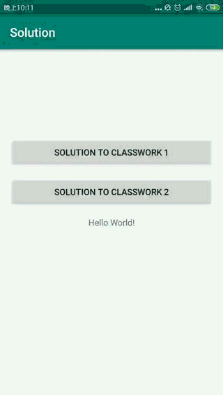
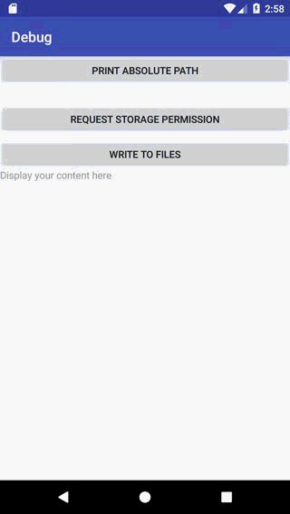

# 摘要

此库为安卓从0-1搭建迷你抖音的教程。每个文件夹即为一个最小可运行单元，**并附带了gif表现最终效果**。

**各文件夹中的README.md拎出了重点实现，供参考。**

**目录如下：**

|说明|文件夹|内容|
|:--|:--|:--|
|基础|01_Foundation|安卓的基本组件|
|安卓UI|02_UI|界面创建时各方法的调用顺序|
|动画|03_Animation|小球动画与方块渐变动画|
|网络|04_Network|请求开发接口与向指定接口上传图片|
|本地存储|05_Storage|利用本地存储实现普通及增强版（带优先级）的便签功能|
|视频|06_Video|视频播放|
|相机|07_Camera|调用系统相机|
|人脸识别|08_FaceDetect|图像人脸识别|

完成后，你可以复刻一个迷你版的抖音。

完成版在个人库：[mini-tiktok](https://github.com/z-waterking/mini-tiktok)

# 实现效果

## 01_Foundation

* 基本组件

## 02_UI

* 界面创建时

* 统计View个数

* 消息列表

## 03_Animation

* 小球动画

* 方块动画

## 04_Network

* 请求图片

* 发送图片

## 05_Storage

* 添加Note

* 更改完成状态

* 删除Note

* 加强版-添加Note

  
      

* 加强版-更改完成状态及删除

* 加强版-写入文件

## 06_Video

* 视频列表，插入封面，点击跳转详情页

* 视频列表自动播放

## 07_Camera

*  调用系统相机进行拍照

*  调用系统相机进行视频录制

    
*  调用Camera实现自动对焦

*  调用Camera进行拍照

*  调用Camera进行视频录制

*  调用Camera进行摄像头切换

    
*  调用Camera打开闪光灯及镜头对焦

## 08_FaceDetect

* 人脸检测

