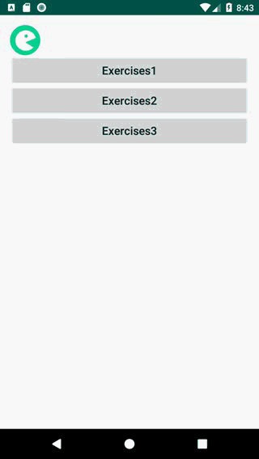
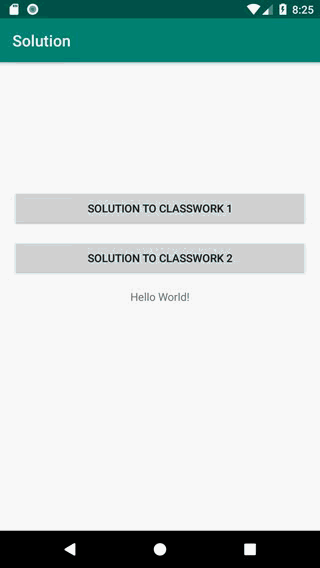
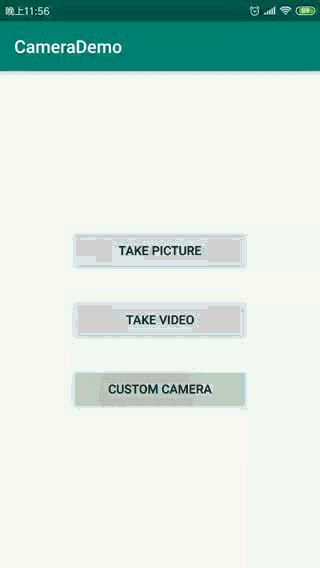
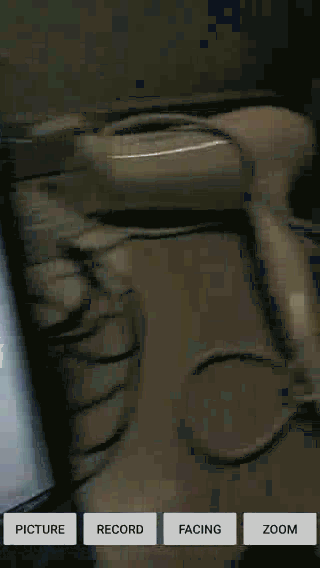

# 实现效果

## 01_Foundation

## 02_UI

## 03_Animation

## 04_Network

## 05_Storage

* 添加Note

* 更改完成状态

* 删除Note

## 06_Video

* 视频列表，插入封面，点击跳转详情页

* 视频列表自动播放

## 07_Camera

*  调用系统相机进行拍照

*  调用系统相机进行视频录制

    
*  调用Camera实现自动对焦

*  调用Camera进行拍照

*  调用Camera进行视频录制

*  调用Camera进行摄像头切换

    
*  调用Camera打开闪光灯及镜头对焦

## 08_FaceDetect

